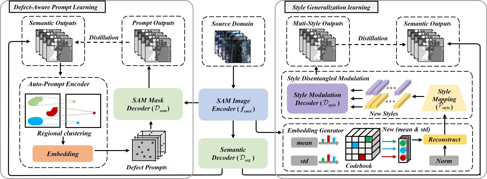

# Single-Source Domain Defect-Aware Adaptation and Style-Modulated Generalization Network (SDSnet)

This repository contains the official implementation of the paper:

> **Single-Source Domain Defect-Aware Adaptation and Style-Modulated Generalization Network for Multispectral Image Segmentation**  
> *Wei Li, Boyu Zhao, Mengmeng Zhang, Yunhao Gao, and Junjie Wang*  
> IEEE Transactions on Cybernetics (TCYB), 2025  
>  
> (https://ieeexplore.ieee.org/document/11223031/)

---

## 🧩 Abstract

Multispectral remote sensing image (MSI) semantic segmentation faces challenges of limited labeled data and significant scene variability. Although Domain Adaptation (DA) and Domain Generalization (DG) methods alleviate these issues to some extent, they still have limitations: DA requires target domain data, while DG suffers from limited task adaptability.  

The recently emerged **Segment Anything (SAM)** model demonstrates exceptional zero-shot generalization capabilities, yet its visible-light training data and interactive prompt requirements prevent direct application to MSI segmentation tasks.  

To address these challenges, we propose **SDSnet** (*Single-Source Domain Defect-Aware Adaptation and Style-Modulated Generalization Network*), which integrates two key innovations:
- **Defect-Aware Prompt Learning**: automatically focuses on high-difficulty regions via entropy-based defect detection.  
- **Style Generalization Learning**: enhances cross-domain adaptability through codebook-based style modulation.  

Through **knowledge distillation**, SDSnet enables efficient inference using only the base network without extra computational overhead. Extensive experiments on three target domains demonstrate SDSnet’s superiority over state-of-the-art DA, DG, and SAM-based methods.

---

## 🧠 Framework Overview

<p align="center">
  
</p>

## ⚙️ Environment Setup

The environment configuration follows the setup in [**MobileSAM**](https://github.com/ChaoningZhang/MobileSAM).  
Please refer to that repository for detailed dependency installation and environment preparation.

---

## 🧪 Experimental Steps

### (1) Data Preparation and Cropping

Prepare datasets and crop them into **512×512** image patches for training and validation.

- **GID Dataset:** Download from [https://captain-whu.github.io/GID/](https://captain-whu.github.io/GID/)  
- **Yellow River Dataset:** Download from [https://github.com/zhaoboyu34526/Alliance](https://github.com/zhaoboyu34526/Alliance)

After downloading, modify the dataset paths in `data_cut.py`, then execute:

```bash
python data_cut.py
```

### (1) Path Configuration

Modify the dataset path arguments in `train_styletest.py`:

```bash
parser.add_argument('--train_map',   default=r'/zbssd/yuyu/code/data512/experiment2021/train/img/',   type=str)
parser.add_argument('--train_label', default=r'/zbssd/yuyu/code/data512/experiment2021/train/label/', type=str)
parser.add_argument('--val_map',     default=r'/zbssd/yuyu/code/data512/experiment2021/val/img/',     type=str)
parser.add_argument('--val_label',   default=r'/zbssd/yuyu/code/data512/experiment2021/val/label/',   type=str)
```
### (1) Model Training

Run the following command to start training:

```bash
python train_styletest.py
```
The training logs and checkpoints will be saved automatically under the default experiment directory.

## 📊 Run Comparison Methods

All baseline and comparison methods can be found in the `compare/` directory.
Each method has a corresponding `.py` file that can be directly executed for independent experiments.
```bash
cd compare
python compare_xxx.py
```

## 📚 Citation

If you find this work useful, please cite:
```bash
@article{li2025sdsnet,
  title={Single-Source Domain Defect-Aware Adaptation and Style-Modulated Generalization Network for Multispectral Image Segmentation},
  author={Li, Wei and Zhao, Boyu and Zhang, Mengmeng and Gao, Yunhao and Wang, Junjie},
  journal={IEEE Transactions on Cybernetics},
  year={2025},
  publisher={IEEE}
}
```
